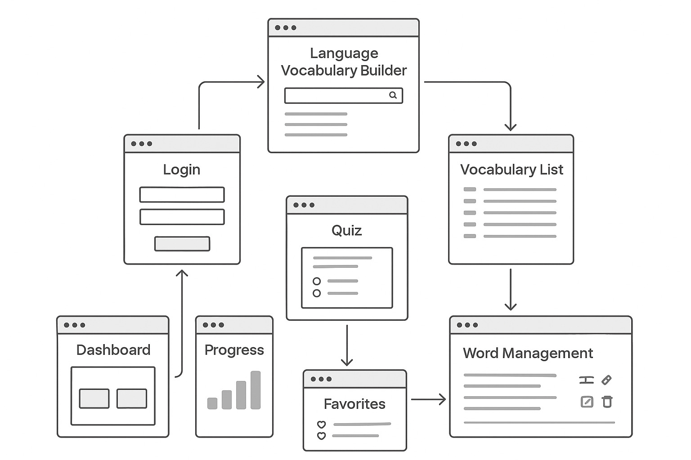

# Language Vocabulary Builder

A clean and efficient **Laravel-based vocabulary learning app** designed to help users learn, manage, and track new language words through quizzes, favorites, progress tracking, and smart word management.

This project is fully built with **Laravel PHP**, offering secure authentication, CRUD functionality, and an interactive learning experience.

---

## 🚀 Features

### 🔐 Authentication

* User registration & login
* Secure session handling

### 📚 Vocabulary Management

* View complete vocabulary list
* Add, edit, update, delete words
* Organize and manage your learning efficiently

### ⭐ Favorites

* Mark important words as favorites
* Review saved words anytime

### 🧠 Quiz System

* Generate quizzes from vocabulary
* Multiple-choice questions
* Real-time results

### 📊 Progress Tracking

* Track total learned words
* View quiz progress and performance

### 🏠 User Dashboard

* Main hub after login
* Quick access to all sections

---

## 🖼️ Project Flow Diagram (UI Structure)

The following diagram represents the flow of the application:


*(Replace with your actual image path from the repo)*

---

## 📂 Project Structure (Laravel)

```
app/
├── Http/
│   ├── Controllers/
│   ├── Middleware/
│   └── Requests/
├── Models/
├── Providers/
routes/
├── web.php
├── api.php
resources/
├── views/
├── css/
├── js/
public/
```

---

## 🛠️ Installation Guide

### 1️⃣ Clone the repository

```bash
git clone https://github.com/your-username/language-vocabulary-builder.git
cd language-vocabulary-builder
```

### 2️⃣ Install dependencies

```bash
composer install
npm install
npm run dev
```

### 3️⃣ Configure environment

Copy .env example:

```bash
cp .env.example .env
```

Generate key:

```bash
php artisan key:generate
```

Set database credentials in `.env` file.

### 4️⃣ Run migrations

```bash
php artisan migrate
```

### 5️⃣ Start development server

```bash
php artisan serve
```

Your app will be live at:

```
http://127.0.0.1:8000
```

---

## 🧩 Tech Stack

* **Laravel 10**
* **PHP 8+**
* **MySQL / MariaDB**
* **Blade Template Engine**
* **TailwindCSS / Bootstrap (choose your setup)**

---

## 🤝 Contributing

Pull requests are welcome! For major changes:

* Open an issue
* Discuss what you want to change
* Submit a PR

---

## 📜 License

This project is under the **MIT License**.

---

## 💌 Contact

For queries or collaboration:
**Millat Hussain**

GitHub: [https://github.com/millathussain66](https://github.com/millathussain66)

Website: [https://millathussain.com](https://millathussain.com)

---

### 🌟 If you like this project, don't forget to star the repo!
